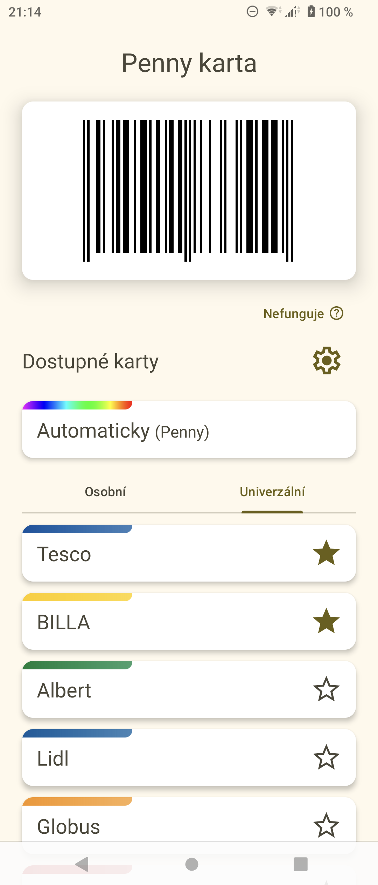

# NoCard pro Android

**\>\> Ke stažení [zde](#instalace) \<\<**

Aplikace slouží jako klient pro webové stránky projektu [NoCard](https://nocard.cz). Kromě toho, co umí samotný web, umí několik věcí navíc:

- off-line režim (data se aktualizují, až když je to potřeba a zařízení je připojené k internetu)
- automatická detekce kartičky k použití podle signálu Wi-Fi z prodejen
- tichá oznámení, ze kterých je lze rovnou otevřít
- podpora přidávání vlastních karet načtením kódu fotoaparátem nebo z obrázku či jeho ručním zadáním
- sdílení osobních karet mezi zařízeními pomocí NFC nebo přes deep linking
- možnost "zakázat" nefunkční karty
- tmavý režim na Androidu 10+, dynamické barvy a animovaná startovací obrazovka na Androidu 12+

Zatím je to tak nějak experimentální, ale už jsem s ní párkrát úspěšně nakoupil.

Kódy kartiček jsou přebírány z webu NoCard a patří neznámým majitelům.

Hlavní obrazovka            |  Notifikace
:-:|:-:
  |  

## Instalace

Aplikaci lze zkompilovat ze zdrojových kódů nebo stáhnout nejnovější stabilní verzi na libovolném z odkazů níže (zkrácený je interně přesměrován na úplný):

- https://nocard.spojenka.cz/stahnout
- https://lab.d3s.mff.cuni.cz:27083/update/download-latest/cz.nocard.android

Automaticky sestavené artefakty z nejnovějšího commitu, podepsané tímtéž klíčem, jsou dostupné z [GitHub Actions](https://github.com/HelloOO7/NoCard-Android/actions/).

## Kompatibilita

Aplikace podporuje Android verze 7.0 a vyšší. Funkce používající skenování Wi-Fi sítí na pozadí vyžadují přinejmenším Android 10.

Na roztodivných odrůdách Androidu, zejména v podání čínských výrobců, je možné, že bude aplikace silně omezována v běhu na pozadí všelijakými tzv. "spořiči baterie" a "zlepšováky výkonu". Pokud zaznamenáte nějaké neobvyklé chování (aplikace neběží, když by měla), zkuste jí z těchto machinací udělit výjimku.

## Skenování Wi-Fi

Rozpoznávání blízkých prodejen funguje na bázi skenování sítí Wi-Fi. Jelikož se jedná o operaci, která je poměrně náročná na baterii, aplikace skenování nevykonává sama, ale jen si říká o výsledky skenů, které dělá čas od času svévolně operační systém. Je tedy očekávané, že se o přítomnosti prodejny nedozví okamžitě při vstupu - záměrem je, aby byla aplikace připravena nejlépe u pokladny. Přesto ale operace na pozadí silně podléhájí náladě Androidu, a tak je možné, že na některých zařízeních nepoběží, dokud nerozsvítíte obrazovku a tak podobně. Nedivte se tedy, pokud se ve stavové liště hned nezobrazí kýžené oznámení - ač to tak na první pohled nevypadá, jedná se (údajně) o fíčuru operačního systému, nikoli brouka.